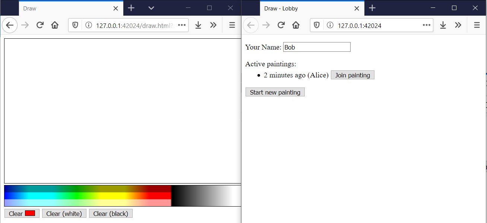
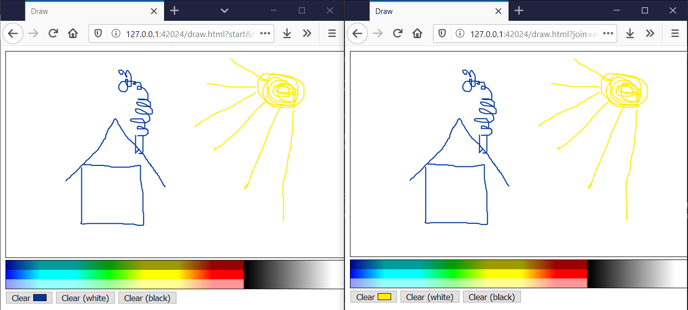

# Remote-Draw

Collaborative painting on a canvas over the network, using socket.io.

Mouse + touch supported.  
Legacy browsers not supported.

  


## Dependencies
* Reverse Proxy: Caddy 2 https://caddyserver.com/
* Backend: Node.js 12
* Messaging: https://socket.io/
* Server: https://github.com/expressjs/express
* UI: https://github.com/hustcc/timeago.js

# Usage
## Install dependencies
```sh
$ ./npm-ci.sh
```

## Run locally
Start the backend server (frontend included):

```sh
$ cd backend
backend$ npm start
```

Afterwards, open http://localhost:42024 to enter the "lobby".  
Open the website in multiple tabs to simulate multiple users.

## Run on a Linux server with HTTPS
If this wasn't just a PoC project, I would call this section "production use".

* Register your internet domain: `DOMAIN` (e.g. `example.com`).  
  Replace `DOMAIN` with your custom domain everywhere below.
* Start a server, e.g. on EC2.  
  Make sure that ports 80 + 443 are publicly available for requesting an HTTPS certificate using ACME (Let's Encrypt).
* Add `A` and/or `AAAA` DNS records for `DOMAIN` and `*.DOMAIN` (or `backend.DOMAIN`).
* Install Node.js 12.
* Install Caddy 2 (used as reverse proxy): https://caddyserver.com/docs/download  
  (Use one of the package manager options, if available for your distribution.)
* Clone the Git repo on the server.
* `./npm-ci.sh`
* `./run.sh DOMAIN`  
  (Press Ctrl-C to exit.)
* Open the website `https://DOMAIN` in your browser.  
  Authenticate using the dummy credentials `user` and `password`. (To disable authentication, remove the `basicauth` block from `proxy/Caddyfile`.)  
  If you get a TLS error, then probably Let's Encrypt can't access your server. Look at the Caddy console output for details.
